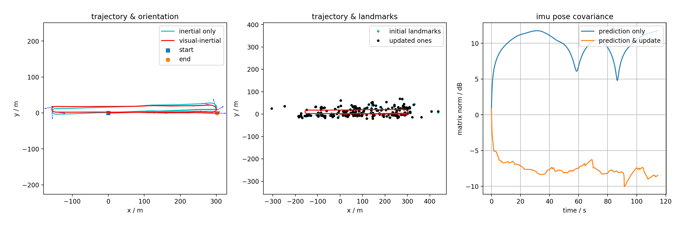
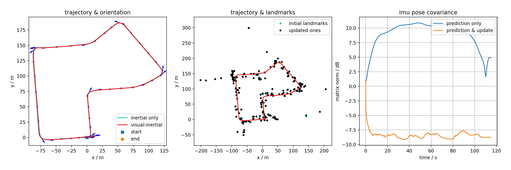
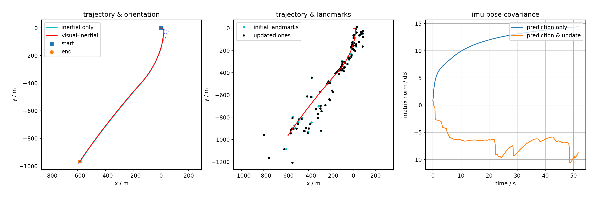

# ECE 276A Project #3 - Visual-Inertial SLAM via EKF

Pengluo Wang,

University of California, San Diego, 2019

### Overview

Implement visual-inertial simultaneous localization and mapping (SLAM) using Extended Kalman filter. Synchronized measurements from a high-quality IMU and a stereo camera have been provided. The data is obtained from [KITTI dataset Raw data](http://www.cvlibs.net/datasets/kitti/raw_data.php?type=residential) and data pre-processing has been completed. The data includes:

* **IMU Measurements**: linear velocity  and angular velocity  measured in the body frame of the IMU 

* **Stereo Camera Images**: pixel coordinates   of detected visual features with precomputed correspondences between the left and the right camera frames.

* **Time Stamps**: time stamps  in UNIX standard seconds-since-the-epoch.

* **Intrinsic Calibration**: stereo baseline  and camera calibration matrix :

  

* **Extrinsic Calibration**: the transformation ) from the IMU to left camera frame.

### Requirements

- Python 3.7

### Installation

If you're using Conda for python environment management:

```
conda create -n vi_slam_env python==3.7
conda activate vi_slam_env
pip install -U pip
pip install -r requirements.txt
```

### Demo

Run

```
python main.py -d 0020
```

### Results

Dataset 0020:



Dataset 0027:



Dataset 0042:

